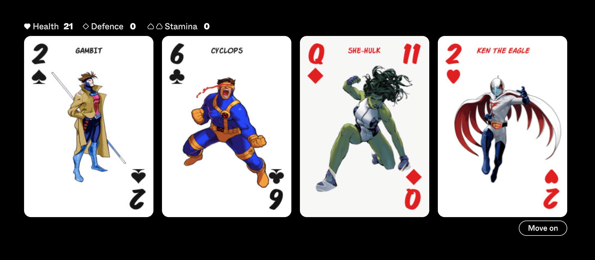

# Super Hero Card Brawl



A Donsol-style card game featuring characters from Capcom's fighting franchises. Fully responsive and playable on any device.

This is a non-commercial personal project. Made for fun! [Play it here](https://evilpaper.com/superherocardbrawl/)

Donsol was originally created by John Eternal—or so it seems. [Read the story here](https://boingboing.net/2015/04/16/the-clone-that-wasnt.html). I encountered it through Hundred Rabbits' awesome version. [Donsol](https://100r.co/site/donsol.html)

## About this project

This project leverages TypeScript and Vite to deliver a robust and highly maintainable codebase for a browser-based game. The design philosophy centers on keeping the core game logic well-structured, with a strong emphasis on separation of concerns.

The architecture is modular, with key components such as Game, Player, Deck, Board, and View split into distinct, reusable modules. Each class adheres to the single responsibility principle, making the code easy to navigate, extend, and debug. The intention has been to keep class properties private and only accessed with getters and setters. TypeScript is a cornerstone of the project, providing type safety that catches issues during compile time, significantly reducing runtime bugs—a critical feature for a game with complex state management.

The View module serves as the bridge between the game logic and the browser, handling DOM updates and user interactions. Event handling in the View class is designed with care, using event listeners to manage player input in a clean and efficient way.

Testing is another key aspect of this project. Using Vitest, the codebase is equipped with unit tests covering core functionality like player actions and deck operations. These tests not only ensure the game behaves as expected but also act as a safeguard against regressions as new features are introduced.

## Built with

- pnpm
- TypeScript
- Vite
- Motion

## Running Locally

The project is using `pnpm` as the package manager. It's like `npm`, but results in fewer `node_modules` saved to disk.

[Install `pnpm` globally](https://pnpm.io/installation).

### Install Dependencies

```sh
# Installs all dependencies
pnpm install
```

### Run locally

```sh
# Run a local dev server
pnpm dev
```

## Run tests

```sh
# Run tests
pnpm test
```

## Run type check

```sh
# Run type check
pnpm type-check
```

## Build for production

```sh
# Build the project for production deployment
pnpm build
```

The build process will generate optimized production files in the `dist` directory, ready for deployment to any static hosting service.

## Todo

[x] - How to play section
[ ] - Text for each action
[ ] - Sound effects
[x] - Image of game in README.md

## How to play

...coming soon

## Contributions

Changes and improvements are more than welcome! Feel free to fork and open a pull request. Please make your changes in a specific branch and request to pull into master! If you can, please make sure the game fully works before sending the PR, as that will help speed up the process.

## Licensing

You are welcome to do whatever you want with the code. The code is licensed under the MIT license.

The graphical assets (images) are owned by Capcom Co.,Ltd. etc. All rights reserved. I bet!

Title font is [Single Fighter](https://www.dafont.com/single-fighter.font)
